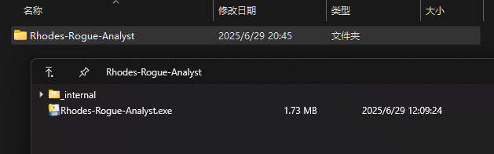
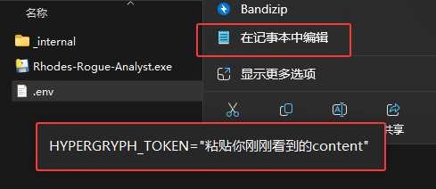
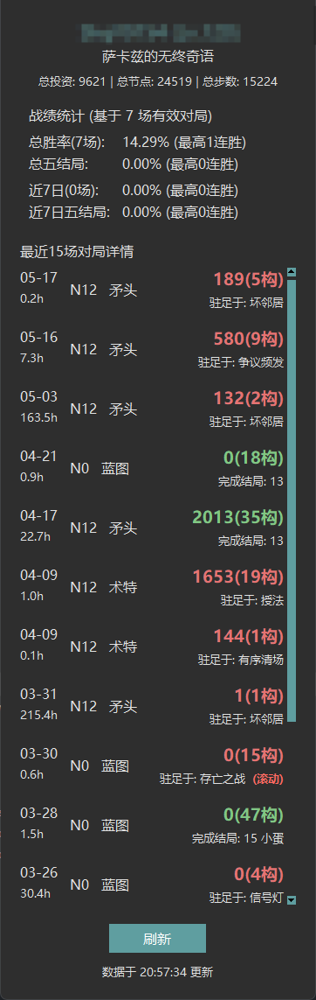

# 罗德岛集成战略分析仪 (Rhodes-Rogue-Analyst)

**`罗德岛集成战略分析仪`** 是一个专为《明日方舟》玩家设计的桌面应用，旨在通过森空岛官方API，获取并深度分析玩家的集成战略游戏数据。本工具提供了一个清晰直观的界面，帮助玩家回顾最近的战局、统计胜率、分析结局达成率，并追踪长期的游戏表现。

## ✨ 主要功能

- **玩家信息展示:** 显示当前登录账号的玩家昵称和等级。
- **生涯数据总览:** 聚合展示玩家在特定集成战略主题下的总投资、总探索节点和总步数。
- **战绩统计分析:**
  - 计算并展示总场次、总胜率和最高连胜纪录。
  - 单独统计“第五结局”（以萨卡兹无终奇语为例）的达成率和最高连胜。
  - 提供近七日的短期战绩统计，帮助玩家了解近期状态。
- **近期对局详情:**
  - 以列表形式展示最近的对局记录。
  - 每条记录包含对局难度、使用分队、最终得分、是否成功、达成结局、耗时、开始日期以及关键物品（如“构想”）的数量。
  - 对“滚动先祖”局进行特殊高亮，清晰区分不同游戏策略。
- **数据持久化:** 所有从API获取的对局记录都会被保存在本地数据库中，确保历史数据的完整性和分析的准确性。
- **一键刷新:** 用户可以随时点击刷新按钮，从服务器获取最新的游戏数据。

## 🚀 如何使用

### 第 1 步：下载程序

- 前往项目的 [**Releases 页面**](https://github.com/choimoe/Rhodes-Rogue-Analyst/releases)。
- 根据您的操作系统，下载最新版本对应的压缩包。例如，Windows 用户请下载名为 `Rhodes-Rogue-Analyst-Windows.zip` 的文件。
### 第 2 步：解压文件

- 将下载好的 `.zip` 压缩包解压到您电脑上任意一个方便的位置，例如桌面。
- 解压后，您会得到一个名为 `Rhodes-Rogue-Analyst` 的文件夹。



### 第 3 步：配置凭证

这是**最关键的一步**，用于授权程序读取您的游戏数据。

- **首次运行**：
  - 直接双击文件夹中的 `Rhodes-Rogue-Analyst.exe` (Windows) 或同名可执行文件 (macOS/Linux)。
  - 程序会检测到您是首次运行，并弹出一个提示框，告知您需要配置凭证。
  - 同时，程序会自动在文件夹内创建一个名为 `.env` 的文件。
- **获取并填写凭证**：
  1. 使用浏览器登录 [**森空岛官网**](https://www.skland.com/)。
  2. 登录后，访问 [**这个链接**](https://web-api.skland.com/account/info/hg)。
  3. 您会看到一段类似于 `{"code":0,"data":{"content":"一长串字符"},"msg":"..."}` 的文本。
  4. **完整复制 `content` 字段后面的那一长串字符** (包括其中的 `+`、`/` 等所有符号)。
  5. 用记事本或任何文本编辑器打开程序文件夹内的 `.env` 文件。
  6. 将您复制好的那一长串字符，粘贴到 `HYPERGRYPH_TOKEN=""` 的双引号中间。
    

> [!WARNING] **您的 `HYPERGRYPH_TOKEN` 是非常私密的个人凭证，请绝对不要以任何形式分享给他人！如果需要他人帮助，请注意使用马赛克等工具隐藏自己的凭证。**
>
> 正确填写后的 `.env` 文件内容示例如下： `HYPERGRYPH_TOKEN="A+B/Caaabbbccc+dd...."`

### 第 4 步：再次运行

- **保存**并关闭 `.env` 文件。
- 再次双击 `Rhodes-Rogue-Analyst.exe`，程序即可正常启动并开始分析您的数据。



## 🛠️ 如何开发

本部分面向希望从源码运行、修改或贡献代码的开发者。

### 1. 环境准备

确保你的计算机上已经安装了 Python 3.10+（推荐使用虚拟环境）。然后，克隆本项目到本地。

```
git clone https://github.com/choimoe/Rhodes-Rogue-Analyst.git
cd Rhodes-Rogue-Analyst
```

### 2. 安装依赖

本项目依赖 `requests` 和 `python-dotenv` 两个外部库。通过 pip 进行安装：

```
pip install -r requirements.txt
```

### 3. 配置凭证

- 在项目的根目录下，创建一个名为 `.env` 的文件。
- 按照上方“如何使用”第 3 步的说明，获取并填写您的 `HYPERGRYPH_TOKEN`。

### 4. 运行应用

完成以上步骤后，直接运行 `main.py` 文件即可启动应用：

```
python main.py
```

## 📐 项目原理与架构

`罗德岛集成战略分析仪` 的核心是围绕森空岛API的数据请求和本地化处理。项目被划分为几个独立的模块，各司其职，以实现高内聚、低耦合的设计。

### 1. 核心目录结构

```
skland/
├── config/                  # 配置文件目录
│   ├── app_config.ini       # API地址和应用参数
│   └── ui_theme.json        # UI主题和样式配置
├── data/                    # 本地数据存储
│   └── rogue_data.db        # SQLite数据库文件
├── logs/                    # 日志文件
│   └── app.log
├── src/
│   ├── api/                 # API客户端
│   │   └── skland_client.py
│   ├── services/            # 业务逻辑服务
│   │   ├── data_manager.py  # 数据持久化管理
│   │   └── rogue_service.py # 集成战略数据分析服务
│   └── ui/                  # 用户界面
│       ├── app_window.py    # 主窗口
│       ├── components.py    # UI组件（如头部、统计面板）
│       ├── controller.py    # UI与业务逻辑的协调器
│       └── styles.py        # 样式管理器
├── .env                     # 环境变量（存储Token）
└── main.py                  # 应用入口
```

### 2. 工作流程

应用的运行流程可以概括为以下几个步骤：

1. **启动与初始化 (`main.py`):**
   - 应用启动，首先加载 `config/app_config.ini` 中的配置和 `.env` 中的 `HYPERGRYPH_TOKEN`。
   - 初始化日志系统，方便调试和追踪问题。
   - 创建 `SklandClient` 实例，并调用其 `authenticate` 方法。该方法会执行完整的登录认证流程：
     1. 使用 `HYPERGRYPH_TOKEN` 获取临时的 `oauth_code`。
     2. 使用 `oauth_code` 获取用于API签名的 `cred` 和 `token`。
     3. 获取并绑定玩家的游戏 `uid`。
   - 认证成功后，创建 `RogueService` (业务服务) 和 `AppWindow` (UI窗口)。
   - 创建 `UIController`，将服务和窗口关联起来，并触发首次数据加载。
2. **数据获取与分析 (`RogueService`):**
   - `UIController` 指示 `RogueService` 获取指定主题（如“萨卡兹的无终奇语”）的数据。
   - `RogueService` 调用 `SklandClient` 的 `get_rogue_info` 方法，向森空岛API发送带有签名头部的GET请求。
   - API返回包含玩家生涯统计、近期对局记录等的JSON数据。
   - `RogueService` 将新的对局记录交由 `DataManager` 合并并存入本地的 `rogue_data.db` 数据库。`DataManager` 采用 `INSERT OR REPLACE` 策略，确保数据不重复且始终为最新。
   - `RogueService` 从数据库中读取该主题下的**所有历史记录**，并进行深度分析（`_analyze_records` 方法）：
     - 区分有效对局（分数大于100）。
     - 筛选出近七天的对局。
     - 分别计算总胜率/连胜和七日胜率/连胜。
     - 通过检查对局中获得的收藏品（`gainRelicList`），精确判断每局的最终结局（如是否为滚动局、是否达成第五结局等）。
   - 最后，`RogueService` 将所有处理和分析好的数据整合成一个字典返回给 `UIController`。
3. **UI更新 (`UIController` & `ui` 模块):**
   - 数据获取在独立的线程中进行，避免UI卡顿。获取成功后，`UIController` 在主线程中调用 `update_ui` 方法。
   - `update_ui` 方法将分析好的数据分发给 `AppWindow` 中的各个UI组件 (`HeaderFrame`, `StatsFrame`, `RunsListFrame`)。
   - 各个组件根据接收到的新数据，更新其显示的文本和样式。例如，`StatsFrame` 更新胜率标签，`RunsListFrame` 则会清空并重新渲染整个对局列表。
   - 底部的状态栏显示数据更新的时间或任何可能发生的错误信息。

### 3. 关键设计

- **分层架构:** **API层** (`skland_client`) 专职与服务器通信和签名，**服务层** (`rogue_service`) 负责业务逻辑和数据分析，**UI层** (`ui` 模块) 负责展示。这种分离使得代码更易于维护和扩展。
- **数据持久化:** 使用SQLite存储所有拉取过的对局记录，避免了每次启动都只能分析最近的几十场对局的局限性，使得长期胜率统计成为可能。
- **异步数据加载:** 借助 `threading` 模块，将耗时的网络请求放在后台线程，保证了UI的流畅响应，提升了用户体验。
- **样式与逻辑分离:** `ui_theme.json` 文件将颜色、字体等样式配置从代码中分离出来，方便用户自定义界面主题，也使得代码本身更加整洁。

## 🤝 贡献

欢迎提交 Pull Requests 或 Issues 来改进这个项目。无论是功能建议、代码优化还是Bug修复，都非常感谢。